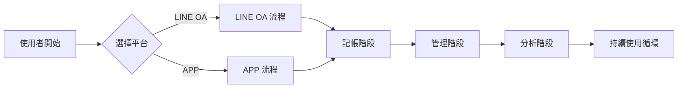

# 0019. User Flow Design

**版本**: 1.0.1  
**建立日期**: 2025-01-20  
**最後更新**: 2025-01-20  
**建立者**: AustinLiao69  

---

## 目次 (Table of Contents)

1. [簡介](#1-簡介)
2. [範圍 (Scope)](#2-範圍-scope)
   - 2.1 [涵蓋範圍](#21-涵蓋範圍)
   - 2.2 [不涵蓋範圍](#22-不涵蓋範圍)
3. [前置條件 (Preconditions)](#3-前置條件-preconditions)
4. [主要 User Flow 圖表](#4-主要-user-flow-圖表)
   - 4.1 [整體架構流程](#41-整體架構流程)
   - 4.2 [詳細流程圖](#42-詳細流程圖)
5. [核心流程詳述](#5-核心流程詳述)
   - 5.1 [進入階段流程](#51-進入階段流程)
     - 5.1.1 [LINE OA 首次加入流程](#511-line-oa-首次加入流程)
     - 5.1.2 [APP 註冊登入流程](#512-app-註冊登入流程)
   - 5.2 [記帳功能流程](#52-記帳功能流程)
     - 5.2.1 [LINE OA 快速記帳流程](#521-line-oa-快速記帳流程)
     - 5.2.2 [APP 完整記帳流程](#522-app-完整記帳流程)
   - 5.3 [管理功能流程](#53-管理功能流程)
     - 5.3.1 [協作帳本管理流程](#531-協作帳本管理流程)
   - 5.4 [分析功能流程](#54-分析功能流程)
     - 5.4.1 [報表生成流程](#541-報表生成流程)
6. [對應 User Story 映射](#6-對應-user-story-映射)
   - 6.1 [Epic 1: 進入階段](#61-epic-1-進入階段)
   - 6.2 [Epic 2: 記帳功能](#62-epic-2-記帳功能)
   - 6.3 [Epic 3-15: 其他功能](#63-epic-3-15-其他功能)
7. [畫面映射 (Screen Mapping)](#7-畫面映射-screen-mapping)
8. [API 映射 (API Mapping)](#8-api-映射-api-mapping)
9. [異常流程 (Alternative / Exception Flow)](#9-異常流程-alternative--exception-flow)
   - 9.1 [登入異常處理](#91-登入異常處理)
   - 9.2 [記帳異常處理](#92-記帳異常處理)
   - 9.3 [協作異常處理](#93-協作異常處理)
10. [後置條件 (Postconditions)](#10-後置條件-postconditions)
    - 10.1 [成功條件](#101-成功條件)
    - 10.2 [失敗條件](#102-失敗條件)
11. [附錄](#11-附錄)
    - 11.1 [詞彙定義](#111-詞彙定義)
    - 11.2 [相關文件](#112-相關文件)
    - 11.3 [版本異動記錄](#113-版本異動記錄)

---

## 1. 簡介

此文件用於描述 LCAS 2.0 使用者在系統中的操作流程，協助產品、設計、開發、QA 對齊需求。內容涵蓋**流程圖、詳細步驟、對應 User Story、畫面及 API 映射**，基於 [0022. Master user flow.mmd](./0022.%20Master%20user%20flow.mmd) 和 [0017. User story.md](./0017.%20User%20story.md) 進行詳細設計。

---

## 2. 範圍 (Scope)

### 2.1 涵蓋範圍
- **進入階段**: LINE OA 加入、APP 註冊登入、跨平台整合
- **記帳功能**: LINE OA 快速記帳、APP 完整記帳、記錄管理
- **管理功能**: 帳本管理、帳戶管理、科目管理、預算管理
- **分析功能**: 報表生成、數據分析、智慧建議

### 2.2 不涵蓋範圍
- 後台管理功能
- 系統維護操作
- 第三方服務整合（Google Analytics 等）

---

## 3. 前置條件 (Preconditions)

- 使用者具備 LINE 帳號或有效 Email 地址
- 行動裝置已安裝 LINE APP 或可存取 APP Store/Google Play
- 網路連線正常
- Firestore 資料庫服務運行正常

---

## 4. 主要 User Flow 圖表

### 4.1 整體架構流程

### 4.2 詳細流程圖
參考 [0022. Master user flow.mmd](./0022.%20Master%20user%20flow.mmd) 中的完整流程圖。

---

## 5. 核心流程詳述

### 5.1 進入階段流程

#### 5.1.1 LINE OA 首次加入流程

| 步驟 | 使用者操作 | 系統回應 | 對應 User Story | 備註 |
|------|------------|----------|-----------------|------|
| 1 | 點選 LINE OA 連結 | 開啟 LINE OA 好友頁面 | US-001 | - |
| 2 | 點選「加入好友」 | 自動發送歡迎訊息 | US-001 | 系統自動觸發 |
| 3 | 系統初始化 | 建立 Firestore 使用者資料 | US-001 | 背景處理 |
| 4 | 顯示 Rich Menu | 提供記帳功能選項 | US-002 | 引導使用者開始記帳 |

#### 5.1.2 APP 註冊登入流程

| 步驟 | 使用者操作 | 系統回應 | 對應 User Story | 備註 |
|------|------------|----------|-----------------|------|
| 1 | 下載並開啟 APP | 顯示註冊/登入頁面 | US-003, US-005 | - |
| 2 | 選擇註冊 | 顯示註冊表單 | US-003 | 新使用者路徑 |
| 3 | 輸入 Email 及密碼 | 發送驗證郵件 | US-003 | - |
| 4 | 點選驗證連結 | 帳號啟用成功 | US-003 | Email 驗證 |
| 5 | 返回 APP 登入 | 進入模式評估問卷 | US-003 | 首次登入流程 |
| 6 | 完成問卷 | 設定個人化記帳環境 | - | 四模式設定 |

### 5.2 記帳功能流程

#### 5.2.1 LINE OA 快速記帳流程

| 步驟 | 使用者操作 | 系統回應 | 對應 User Story | 備註 |
|------|------------|----------|-----------------|------|
| 1 | 輸入記帳訊息 | 解析文字內容 | US-008 | 如："午餐 150" |
| 2 | 系統解析成功 | 顯示解析結果確認 | US-008 | 金額、科目、備註 |
| 3 | 使用者確認 | 寫入 Firestore 資料庫 | US-008 | - |
| 4 | 資料寫入成功 | 回覆記帳成功訊息 | US-008 | 包含記帳摘要 |
| 5 | (可選) 查詢統計 | 顯示收支統計 | US-015 | 如："今日收支" |

#### 5.2.2 APP 完整記帳流程

| 步驟 | 使用者操作 | 系統回應 | 對應 User Story | 備註 |
|------|------------|----------|-----------------|------|
| 1 | 點選「新增記帳」 | 開啟記帳表單 | US-010 | - |
| 2 | 輸入金額 | 即時格式驗證 | US-010 | 必填欄位 |
| 3 | 選擇科目 | 顯示科目列表 | US-010 | 收入/支出分類 |
| 4 | 選擇帳戶 | 顯示帳戶列表 | US-010 | 現金、銀行等 |
| 5 | 選擇帳本 | 顯示帳本列表 | US-011 | 個人、協作等 |
| 6 | 輸入備註 | - | US-010 | 選填欄位 |
| 7 | (可選) 附加圖片 | 開啟相機/相冊 | US-013 | - |
| 8 | (可選) 設定重複 | 顯示重複規則選項 | US-012 | - |
| 9 | 點選「儲存」 | 記帳成功確認 | US-010 | 同步至資料庫 |

### 5.3 管理功能流程

#### 5.3.1 協作帳本管理流程

| 步驟 | 使用者操作 | 系統回應 | 對應 User Story | 備註 |
|------|------------|----------|-----------------|------|
| 1 | 點選「建立協作帳本」 | 開啟建立表單 | US-017 | - |
| 2 | 輸入帳本名稱與描述 | - | US-017 | - |
| 3 | 設定初始權限 | 顯示權限選項 | US-017 | 檢視/編輯/管理 |
| 4 | 點選「建立」 | 帳本建立成功 | US-017 | - |
| 5 | 點選「邀請協作者」 | 生成邀請連結 | US-018 | - |
| 6 | 發送邀請通知 | 協作者收到邀請 | US-018 | LINE/Email 通知 |
| 7 | 協作者接受邀請 | 加入協作帳本 | US-018 | - |
| 8 | 開始協作記帳 | 即時同步與通知 | US-018 | - |

### 5.4 分析功能流程

#### 5.4.1 報表生成流程

| 步驟 | 使用者操作 | 系統回應 | 對應 User Story | 備註 |
|------|------------|----------|-----------------|------|
| 1 | 點選「報表分析」 | 開啟報表功能 | US-026 | - |
| 2 | 選擇報表類型 | 顯示標準/自訂選項 | US-026 | - |
| 3 | 設定時間範圍 | 日曆選擇器 | US-026 | - |
| 4 | 選擇資料範圍 | 帳本/帳戶/科目篩選 | US-026 | - |
| 5 | 選擇圖表類型 | 圓餅圖/長條圖/折線圖 | US-026 | - |
| 6 | 點選「生成報表」 | 顯示報表預覽 | US-026 | - |
| 7 | 確認報表內容 | 提供下載/分享選項 | US-027 | PDF/CSV 格式 |

---

## 6. 對應 User Story 映射

### 6.1 Epic 1: 進入階段
- **US-001**: LINE OA 加入流程 (步驟 5.1.1)
- **US-002**: APP 下載引導推廣
- **US-003**: APP 註冊流程 (步驟 5.1.2)
- **US-004**: LINE OA 推廣整合
- **US-005**: APP 登入流程 (步驟 5.1.2)
- **US-006**: 忘記密碼處理
- **US-007**: LINE OA 快速進入

### 6.2 Epic 2: 記帳功能
- **US-008**: LINE OA 快速記帳 (步驟 5.2.1)
- **US-009**: LINE OA 多帳本記帳
- **US-010**: APP 完整記帳 (步驟 5.2.2)
- **US-011**: APP 多帳本記帳
- **US-012**: APP 重複交易設定
- **US-013**: APP 附加記帳圖片
- **US-014**: APP 收支統計查看
- **US-015**: LINE OA 收支統計查詢
- **US-016**: 記帳記錄管理

### 6.3 Epic 3-15: 其他功能
詳見 [0017. User story.md](./0017.%20User%20story.md) 完整對應關係。

---

## 7. 畫面映射 (Screen Mapping)

| 畫面 ID | 畫面名稱 | 對應流程步驟 | 主要功能 |
|---------|----------|--------------|----------|
| S-001 | LINE OA 歡迎頁 | 5.1.1-2 | 顯示歡迎訊息與 Rich Menu |
| S-002 | APP 註冊頁 | 5.1.2-2 | Email 註冊表單 |
| S-003 | APP 登入頁 | 5.1.2-5 | Email/Google 登入 |
| S-004 | 模式評估問卷頁 | 5.1.2-6 | 四模式判斷問卷 |
| S-005 | APP 主頁 | - | 主要功能導航 |
| S-006 | LINE OA 記帳對話 | 5.2.1 | 文字記帳輸入 |
| S-007 | APP 記帳表單頁 | 5.2.2 | 完整記帳輸入表單 |
| S-008 | 協作帳本管理頁 | 5.3.1 | 協作帳本建立與管理 |
| S-009 | 報表分析頁 | 5.4.1 | 報表設定與生成 |
| S-010 | 圖表顯示頁 | 5.4.1-6 | 各類圖表展示 |

---

## 8. API 映射 (API Mapping)

| API 名稱 | Method | Endpoint | 對應流程步驟 | 說明 |
|----------|--------|----------|--------------|------|
| 使用者註冊 | POST | /api/auth/register | 5.1.2-3 | Email 註冊驗證 |
| 使用者登入 | POST | /api/auth/login | 5.1.2-5 | 帳號密碼驗證 |
| LINE Webhook | POST | /api/webhook/line | 5.2.1-1 | 接收 LINE 訊息 |
| 建立記帳記錄 | POST | /api/transactions | 5.2.1-3, 5.2.2-9 | 新增交易資料 |
| 取得統計資料 | GET | /api/statistics | 5.2.1-5 | 收支統計查詢 |
| 建立協作帳本 | POST | /api/ledgers/collaborative | 5.3.1-4 | 建立協作帳本 |
| 邀請協作者 | POST | /api/ledgers/{id}/invite | 5.3.1-5 | 發送協作邀請 |
| 生成報表 | POST | /api/reports/generate | 5.4.1-6 | 生成分析報表 |
| 下載報表 | GET | /api/reports/{id}/download | 5.4.1-7 | 下載報表檔案 |

---

## 9. 異常流程 (Alternative / Exception Flow)

### 9.1 登入異常處理
- **異常 1**: 密碼錯誤 → 顯示錯誤訊息並允許重試（最多 3 次）
- **異常 2**: 帳號不存在 → 引導至註冊頁面
- **異常 3**: 網路連線問題 → 顯示「請檢查網路連線」提示

### 9.2 記帳異常處理
- **異常 1**: LINE OA 文字解析失敗 → 提供記帳格式說明
- **異常 2**: 資料庫寫入失敗 → 暫存本地並提供重試機制
- **異常 3**: 金額格式錯誤 → 即時驗證並提示正確格式

### 9.3 協作異常處理
- **異常 1**: 邀請連結過期 → 重新生成邀請連結
- **異常 2**: 權限不足操作 → 顯示權限說明並聯繫管理者
- **異常 3**: 協作衝突 → 提供衝突解決機制

---

## 10. 後置條件 (Postconditions)

### 10.1 成功條件
- **進入階段**: 使用者成功註冊/登入並完成初始設定
- **記帳功能**: 記帳資料成功儲存並同步至所有平台
- **管理功能**: 帳本/帳戶/科目設定正確保存並生效
- **分析功能**: 報表成功生成並可正常下載/分享

### 10.2 失敗條件
- **進入階段**: 使用者停留於註冊/登入頁面，需重新操作
- **記帳功能**: 記帳資料未成功儲存，需重新提交
- **管理功能**: 設定變更未生效，需檢查權限或重新設定
- **分析功能**: 報表生成失敗，需調整參數或聯繫客服

---

## 11. 附錄

### 11.1 詞彙定義
- **帳本**: 記帳資料的邏輯分組，如個人帳本、家庭帳本、專案帳本
- **科目**: 收支分類項目，如餐飲、交通、薪資等
- **帳戶**: 資金來源，如現金、銀行存款、信用卡等
- **協作者**: 具有帳本存取權限的其他使用者
- **Rich Menu**: LINE OA 的自定義選單功能

### 11.2 相關文件
- [0015. Product_SPEC_LCAS_2.0.md](./0015.%20Product_SPEC_LCAS_2.0.md) - 產品規格書
- [0016. User story map.md](./0016.%20User%20story%20map.md) - 使用者故事地圖
- [0017. User story.md](./0017.%20User%20story.md) - 詳細使用者故事
- [0022. Master user flow.mmd](./0022.%20Master%20user%20flow.mmd) - 主要使用者流程圖

### 11.3 版本異動記錄
| 版本 | 日期 | 變更內容 | 變更者 |
|------|------|----------|--------|
| 1.0.0 | 2025-01-20 | 初始版本建立 | AustinLiao69 |
| 1.0.1 | 2025-01-20 | 基於 Master user flow 完善內容 | AustinLiao69 |
