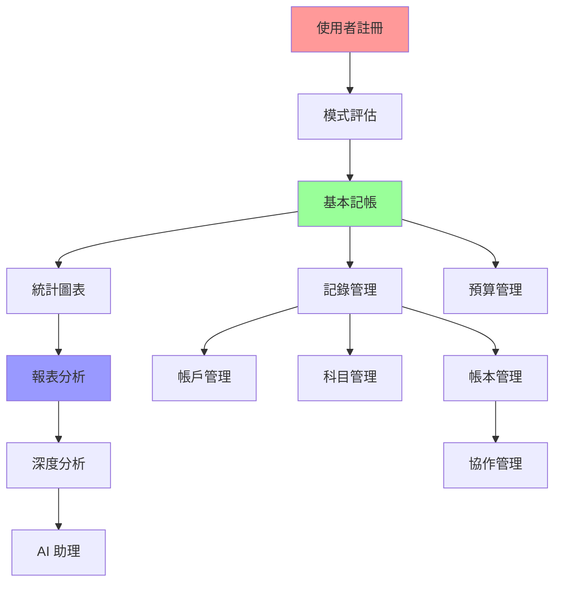

# 0023. Screen-API mapping list

**版本**: 1.0.0  
**建立日期**: 2025-01-27  
**最後更新**: 2025-01-27  
**建立者**: AustinLiao69  

---

## 目次 (Table of Contents)

### 1. [簡介](#1-簡介)
### 2. [映射策略 (Mapping Strategy)](#2-映射策略-mapping-strategy)
   - 2.1 [三維映射架構](#21-三維映射架構)
   - 2.2 [四模式差異化實現](#22-四模式差異化實現)
   - 2.3 [開發優先級策略](#23-開發優先級策略)

### 3. [總覽映射矩陣 (Master Mapping Matrix)](#3-總覽映射矩陣-master-mapping-matrix)
   - 3.1 [核心功能映射表](#31-核心功能映射表)
   - 3.2 [API 依賴關係圖](#32-api-依賴關係圖)
   - 3.3 [四模式回應差異表](#33-四模式回應差異表)

### 4. [Epic 分組映射 (Epic-based Mapping)](#4-epic-分組映射-epic-based-mapping)
   - 4.1 [Epic 1: 進入階段映射](#41-epic-1-進入階段映射)
   - 4.2 [Epic 2: 記帳功能映射](#42-epic-2-記帳功能映射)
   - 4.3 [Epic 3-6: 管理功能映射](#43-epic-3-6-管理功能映射)
   - 4.4 [Epic 7-9: 分析功能映射](#44-epic-7-9-分析功能映射)
   - 4.5 [Epic 10-15: 系統功能映射](#45-epic-10-15-系統功能映射)

### 5. [開發實現指引 (Development Guidelines)](#5-開發實現指引-development-guidelines)
   - 5.1 [API 實現優先級](#51-api-實現優先級)
   - 5.2 [畫面開發依賴順序](#52-畫面開發依賴順序)
   - 5.3 [四模式測試策略](#53-四模式測試策略)

### 6. [品質確保檢查表 (QA Checklist)](#6-品質確保檢查表-qa-checklist)
### 7. [版本紀錄](#7-版本紀錄)

---

## 1. 簡介

本文件建立 [0021. Screen list.md](./0021.%20Screen%20list.md) 的 40 個畫面與 [0020. API list.md](./0020.%20API%20list.md) 的 126 個 API 端點之間的完整映射關係。作為資深 SA，本文件不僅提供功能對應，更深入分析四模式差異化實現策略，為開發團隊提供**清晰的實現路徑**與**測試驗收標準**。

**核心價值**：
- **開發效率**：明確的 Screen → API 對應關係，避免遺漏與重複開發
- **四模式一致性**：確保相同畫面在不同模式下的 API 調用策略
- **測試完整性**：提供完整的功能驗收標準
- **維護性**：建立系統性的功能擴展框架

---

## 2. 映射策略 (Mapping Strategy)

### 2.1 三維映射架構

```
Screen (畫面) ←→ API (端點) ←→ User Mode (模式)
       ↓              ↓              ↓
   UI/UX設計     ←→  後端實現    ←→   業務邏輯
       ↓              ↓              ↓
   前端開發     ←→  API開發     ←→   差異化策略
```

**設計原則**：
1. **畫面驅動**：每個畫面功能完整性優先
2. **API 複用**：最大化 API 端點的重用性
3. **模式區隔**：同一 API 根據模式回應不同資料深度
4. **擴展性**：預留未來功能擴展的彈性

### 2.2 四模式差異化實現

| 差異化層級 | Expert | Inertial | Cultivation | Guiding |
|------------|--------|----------|-------------|---------|
| **API 回應資料量** | 100% 完整 | 80% 標準 | 70% 精選 + 激勵 | 50% 極簡 |
| **動態內容** | 複雜分析 | 固定模板 | 進度追蹤 | 基本資訊 |
| **互動選項** | 全功能 | 標準選項 | 引導選項 | 最少選項 |
| **個人化程度** | 高度客製 | 中度固定 | 習慣導向 | 最少決策 |

### 2.3 開發優先級策略

| 優先級 | 說明 | 對應功能 | 實現策略 |
|--------|------|----------|----------|
| **P1 - 核心功能** | MVP 必要功能 | 註冊、登入、基本記帳 | 先實現基本版本，後續擴展四模式 |
| **P2 - 標準功能** | 完整體驗功能 | 管理、協作、報表 | 同步實現多模式支援 |
| **P3 - 增值功能** | 差異化功能 | AI 助理、遊戲化 | 針對特定模式優化 |

---

## 3. 總覽映射矩陣 (Master Mapping Matrix)

### 3.1 核心功能映射表

| 畫面 ID | 畫面名稱 | 主要 API | 輔助 API | 模式差異重點 | 優先級 |
|---------|----------|----------|----------|--------------|--------|
| **進入階段** | | | | | |
| S-101 | LINE OA 歡迎頁 | - | `GET /system/welcome` | 文案差異 | P1 |
| S-102 | APP 啟動頁 | `GET /system/app-info` | - | 統一呈現 | P1 |
| S-103 | APP 註冊頁 | `POST /auth/register` | `POST /auth/verify-email` | 表單複雜度 | P1 |
| S-104 | APP 登入頁 | `POST /auth/login` | `POST /auth/google-login` | 登入選項數量 | P1 |
| S-105 | 忘記密碼頁 | `POST /auth/forgot-password` | `POST /auth/reset-password` | 統一呈現 | P1 |
| S-106 | 模式評估問卷頁 | `POST /users/assessment` | `GET /users/assessment-questions` | 首次登入 | P1 |
| S-107 | 跨平台綁定頁 | `POST /auth/bind-line` | `GET /auth/bind-status` | 功能說明深度 | P2 |
| S-108 | APP 下載推廣頁 | `GET /system/app-promotion` | - | 推廣策略 | P2 |
| **記帳核心** | | | | | |
| S-201 | LINE OA 記帳對話 | `POST /transactions/quick` | `GET /transactions/statistics` | 指令複雜度 | P1 |
| S-202 | APP 記帳主頁 | `GET /transactions/dashboard` | `GET /transactions/recent` | 資料豐富度 | P1 |
| S-203 | APP 記帳表單頁 | `POST /transactions` | `PUT /transactions/{id}` | 表單欄位數量 | P1 |
| S-204 | 科目選擇頁 | `GET /categories` | `POST /categories` | 科目樹深度 | P1 |
| S-205 | 帳戶選擇頁 | `GET /accounts` | `GET /accounts/{id}/balance` | 帳戶資訊詳細度 | P1 |
| S-206 | 帳本選擇頁 | `GET /ledgers` | `GET /ledgers/{id}/permissions` | 管理功能複雜度 | P1 |
| S-207 | 圖片附加頁 | `POST /transactions/{id}/attachments` | `DELETE /transactions/{id}/attachments/{attachmentId}` | 編輯工具豐富度 | P2 |
| S-208 | 重複設定頁 | `POST /transactions/recurring` | `PUT /transactions/recurring/{id}` | 排程規則複雜度 | P2 |
| S-209 | 記錄管理頁 | `GET /transactions` | `DELETE /transactions/{id}` | 操作工具豐富度 | P1 |
| S-210 | 記錄編輯頁 | `GET /transactions/{id}` | `PUT /transactions/{id}` | 編輯功能深度 | P1 |
| S-211 | 統計圖表頁 | `GET /transactions/charts` | `GET /transactions/statistics` | 分析工具複雜度 | P1 |

### 3.2 API 依賴關係圖



### 3.3 四模式回應差異表

| API 端點 | Expert Mode | Inertial Mode | Cultivation Mode | Guiding Mode |
|----------|-------------|---------------|------------------|--------------|
| `GET /transactions/dashboard` | 完整數據 + 工具 | 標準統計 + 圖表 | 進度 + 激勵 | 極簡摘要 |
| `GET /categories` | 完整分類樹 | 常用科目 | 推薦科目 | 基本科目 |
| `GET /reports/templates` | 專業模板 | 標準模板 | 習慣追蹤模板 | 基本摘要 |
| `GET /gamification/achievements` | 不顯示 | 簡化顯示 | **豐富激勵** | 基本成就 |

---

## 4. Epic 分組映射 (Epic-based Mapping)

### 4.1 Epic 1: 進入階段映射

#### 4.1.1 核心流程
```
S-102 (啟動) → S-103/S-104 (註冊/登入) → S-106 (評估) → S-202 (主頁)
     ↓              ↓                   ↓              ↓
system/app-info → auth/register → users/assessment → transactions/dashboard
```

#### 4.1.2 詳細映射

| 畫面 | 主要流程 | API 序列 | 錯誤處理 | 四模式差異 |
|------|----------|----------|----------|------------|
| **S-103 註冊頁** | 1. 輸入驗證<br>2. 送出註冊<br>3. 驗證信箱 | `POST /auth/register`<br>`POST /auth/verify-email` | 重複 Email 檢查<br>格式驗證失敗 | **Expert**: 完整表單<br>**Guiding**: 最簡表單 |
| **S-106 評估頁** | 1. 載入問卷<br>2. 收集答案<br>3. 計算模式 | `GET /users/assessment-questions`<br>`POST /users/assessment` | 問卷載入失敗<br>評估計算錯誤 | 問卷複雜度調整 |

#### 4.1.3 跨平台整合策略

| 整合點 | LINE OA 流程 | APP 流程 | API 橋接 |
|--------|--------------|----------|----------|
| **帳號綁定** | Rich Menu 推廣 → QR Code | 綁定設定 → 掃描確認 | `POST /auth/bind-line` |
| **資料同步** | 快速記帳 | 完整記帳 | 共用 `/transactions` API |

### 4.2 Epic 2: 記帳功能映射

#### 4.2.1 雙平台記帳流程

| 平台 | 記帳方式 | 主要 API | 資料流 | 四模式適配 |
|------|----------|----------|--------|------------|
| **LINE OA** | 文字解析 | `POST /transactions/quick` | 輸入 → 解析 → 確認 → 儲存 | **Expert**: 複雜指令<br>**Guiding**: 基本格式 |
| **APP** | 表單填寫 | `POST /transactions` | 選擇 → 輸入 → 確認 → 儲存 | **Expert**: 全欄位<br>**Guiding**: 必要欄位 |

#### 4.2.2 記帳表單 API 調用序列

```json
// S-203 APP 記帳表單頁 API 調用順序
{
  "onPageLoad": [
    "GET /categories",      // 載入科目選項
    "GET /accounts",        // 載入帳戶選項
    "GET /ledgers"          // 載入帳本選項
  ],
  "onSubmit": [
    "POST /transactions",   // 主要記帳 API
    "POST /transactions/{id}/attachments"  // 附件上傳（如有）
  ],
  "onError": [
    "GET /system/retry"     // 重試機制
  ]
}
```

#### 4.2.3 四模式差異實現

| 畫面功能 | Expert | Inertial | Cultivation | Guiding |
|----------|--------|----------|-------------|---------|
| **S-202 主頁** | 複雜儀表板 | 標準統計 | 進度追蹤 | 一鍵記帳 |
| **S-203 表單** | 並列完整表單 | 分步驟引導 | 智慧建議 | 最簡輸入 |
| **S-211 圖表** | 互動分析工具 | 固定圖表 | 成就視覺化 | 基本統計 |

### 4.3 Epic 3-6: 管理功能映射

#### 4.3.1 管理功能層級架構

```
帳本管理 (S-301/302/303)
    ↓
帳戶管理 (S-304/305) + 科目管理 (S-306) + 預算管理 (S-307/308)
    ↓
交易記錄 (S-209/210)
```

#### 4.3.2 協作管理特殊映射 (S-303)

| 協作功能 | API 端點 | 權限檢查 | 四模式差異 |
|----------|----------|----------|------------|
| **查看協作者** | `GET /ledgers/{id}/collaborators` | 檢視權限 | **Expert**: 詳細權限資訊<br>**Others**: 基本成員清單 |
| **邀請成員** | `POST /ledgers/{id}/invitations` | 管理權限 | **Expert**: 細粒度角色設定<br>**Others**: 簡單成員/管理員 |
| **衝突解決** | `GET /ledgers/{id}/conflicts`<br>`POST /ledgers/{id}/resolve-conflict` | 管理權限 | **Expert**: 手動解決選項<br>**Others**: 自動解決建議 |

#### 4.3.3 預算管理映射策略

| 使用者模式 | 預算複雜度 | 主要 API | 監控策略 |
|------------|------------|----------|----------|
| **Expert** | 複雜預算規則 | `POST /budgets` + 完整設定 | 詳細分析報告 |
| **Cultivation** | 目標導向預算 | `POST /budgets` + 模板 | 進度追蹤 + 激勵 |
| **Inertial/Guiding** | 簡單預算 | `POST /budgets` + 預設值 | 基本警示 |

### 4.4 Epic 7-9: 分析功能映射

#### 4.4.1 報表生成流程映射

```
S-401 (報表主頁) → S-402 (設定) → S-403 (展示) → S-404 (下載)
       ↓              ↓            ↓            ↓
   templates      generate      charts       export
```

#### 4.4.2 AI 助理功能映射 (S-406)

| AI 功能 | API 端點 | 輸入資料 | 輸出結果 | 模式適配 |
|---------|----------|----------|----------|----------|
| **智慧分類** | `POST /ai/categorize` | 交易描述 | 建議科目 | **Expert**: 多選項<br>**Guiding**: 單一建議 |
| **預算建議** | `POST /ai/budget-advice` | 歷史支出 | 預算建議 | **Cultivation**: 目標設定<br>**Expert**: 詳細分析 |
| **異常檢測** | `POST /ai/anomaly-detection` | 交易模式 | 異常警示 | **Expert**: 詳細報告<br>**Others**: 簡單提醒 |

#### 4.4.3 深度分析映射 (S-405)

| 分析類型 | API 端點 | 資料來源 | 四模式回應差異 |
|----------|----------|----------|----------------|
| **趨勢分析** | `GET /analytics/trends` | 歷史交易 | **Expert**: 統計模型<br>**Others**: 視覺化趨勢 |
| **支出洞察** | `POST /ai/spending-insights` | 支出模式 | **Expert**: 詳細分析<br>**Cultivation**: 習慣建議 |

### 4.5 Epic 10-15: 系統功能映射

#### 4.5.1 激勵系統映射 (S-501)

| 激勵元素 | API 端點 | 觸發條件 | 模式特化 |
|----------|----------|----------|----------|
| **成就系統** | `GET /gamification/achievements` | 行為完成 | **Cultivation**: 豐富成就<br>**Others**: 基本里程碑 |
| **挑戰機制** | `GET /gamification/challenges` | 週期性任務 | **Cultivation**: 多樣挑戰<br>**Others**: 簡單目標 |
| **獎勵領取** | `POST /gamification/claim-reward` | 成就解鎖 | **Cultivation**: 多種獎勵<br>**Others**: 基本回饋 |

#### 4.5.2 通知管理映射 (S-504)

| 通知類型 | API 端點 | 設定複雜度 | 模式差異 |
|----------|----------|------------|----------|
| **記帳提醒** | `POST /notifications/reminders` | 時間 + 頻率 | **Cultivation**: 智慧提醒<br>**Expert**: 詳細規則<br>**Guiding**: 簡單開關 |
| **預算警示** | `PUT /notifications/settings` | 閾值設定 | **Expert**: 多層級警示<br>**Others**: 基本警示 |

---

## 5. 開發實現指引 (Development Guidelines)

### 5.1 API 實現優先級

#### 5.1.1 Phase 1 - 核心 MVP (P1)
```
認證服務 → 基本記帳 → 記錄管理 → 基本統計
   ↓           ↓          ↓          ↓
 10 APIs    8 APIs    6 APIs    4 APIs
```

| 開發週 | 實現 API | 對應畫面 | 驗收標準 |
|--------|----------|----------|----------|
| Week 1-2 | 認證 API (10個) | S-102~S-106 | 四模式註冊登入流程 |
| Week 3-4 | 記帳 API (8個) | S-201~S-203 | 雙平台記帳功能 |
| Week 5-6 | 管理 API (6個) | S-209~S-211 | 記錄 CRUD 操作 |
| Week 7-8 | 統計 API (4個) | S-211 | 基本圖表展示 |

#### 5.1.2 Phase 2 - 完整功能 (P2)
```
管理功能 → 報表分析 → 協作功能
   ↓           ↓          ↓
 18 APIs    13 APIs    8 APIs
```

#### 5.1.3 Phase 3 - 增值功能 (P3)
```
AI 助理 → 遊戲化 → 進階系統
   ↓         ↓        ↓
 6 APIs   6 APIs   8 APIs
```

### 5.2 畫面開發依賴順序

#### 5.2.1 前端開發路徑


#### 5.2.2 API 測試依賴
| 畫面群組 | 依賴 API | 模擬資料需求 | 測試重點 |
|----------|----------|--------------|----------|
| **進入階段** | 認證 + 用戶管理 | 測試帳號 + 問卷資料 | 四模式評估正確性 |
| **記帳功能** | 認證 + 記帳 + 管理 | 科目/帳戶/帳本資料 | 雙平台一致性 |
| **分析功能** | 全部 API | 歷史交易資料 | 四模式回應差異 |

### 5.3 四模式測試策略

#### 5.3.1 模式切換測試
```javascript
// 四模式測試案例範例
describe('四模式 API 回應測試', () => {
  const testCases = [
    { mode: 'Expert', expectedFields: 15, complexityLevel: 'high' },
    { mode: 'Inertial', expectedFields: 10, complexityLevel: 'medium' },
    { mode: 'Cultivation', expectedFields: 8, complexityLevel: 'guided' },
    { mode: 'Guiding', expectedFields: 5, complexityLevel: 'minimal' }
  ];
  
  testCases.forEach(testCase => {
    test(`${testCase.mode} 模式回應驗證`, async () => {
      const response = await api.get('/transactions/dashboard', {
        headers: { 'X-User-Mode': testCase.mode }
      });
      expect(Object.keys(response.data)).toHaveLength(testCase.expectedFields);
    });
  });
});
```

#### 5.3.2 跨模式一致性測試
| 測試面向 | 驗證重點 | 自動化測試 |
|----------|----------|------------|
| **資料一致性** | 相同 API 不同模式回應的核心資料一致 | ✅ 自動化 |
| **功能完整性** | 所有模式都能完成基本業務流程 | ✅ 自動化 |
| **效能一致性** | 不同模式的 API 回應時間合理 | ✅ 自動化 |
| **使用者體驗** | 模式切換的流暢性 | ⚠️ 手動測試 |

---

## 6. 品質確保檢查表 (QA Checklist)

### 6.1 功能完整性檢查

#### 6.1.1 畫面-API 對應完整性
- [ ] 所有 40 個畫面都有對應的主要 API
- [ ] 每個 API 都有明確的畫面使用場景
- [ ] 輔助 API 的調用時機明確定義
- [ ] 錯誤處理 API 的回退機制設計完整

#### 6.1.2 四模式差異化實現
- [ ] 每個模式的 API 回應策略清楚定義
- [ ] 關鍵功能在所有模式下都可使用
- [ ] 模式特有功能（如 Cultivation 的遊戲化）正確實現
- [ ] 模式間切換不會造成資料遺失

#### 6.1.3 跨平台一致性
- [ ] LINE OA 與 APP 的核心功能對等
- [ ] 資料同步機制正常運作
- [ ] 平台特有功能（如 Rich Menu）正確整合

### 6.2 開發效率檢查

#### 6.2.1 API 設計合理性
- [ ] API 端點命名遵循 RESTful 原則
- [ ] 資料格式統一，減少前端適配工作
- [ ] 批次操作 API 支援效率提升
- [ ] 分頁與篩選機制完整

#### 6.2.2 開發團隊協作
- [ ] 前端團隊能清楚理解 API 調用時機
- [ ] 後端團隊了解四模式差異化需求
- [ ] QA 團隊有完整的測試用例參考
- [ ] PM 有明確的功能驗收標準

### 6.3 系統擴展性檢查

#### 6.3.1 未來功能預留
- [ ] API 架構支援新功能的擴展
- [ ] 四模式框架可容納新的使用者類型
- [ ] 畫面設計預留新功能的空間
- [ ] 資料模型支援業務邏輯的演進

#### 6.3.2 效能與維護性
- [ ] API 回應時間在可接受範圍內
- [ ] 快取策略針對不同模式優化
- [ ] 日誌與監控機制完整
- [ ] 文件更新流程明確

---

## 7. 版本紀錄

| 版本 | 日期 | 修改內容 | 修改者 |
|------|------|----------|--------|
| 1.0.0 | 2025-01-27 | 建立完整 Screen-API 映射文件，包含四模式差異化實現策略 | AustinLiao69 |

---

**文件狀態**: ✅ 已核准  
**下一步行動**: 基於此映射文件開始 API 開發與前端實現  
**相關文件**: [0020. API list.md](./0020.%20API%20list.md) | [0021. Screen list.md](./0021.%20Screen%20list.md)
